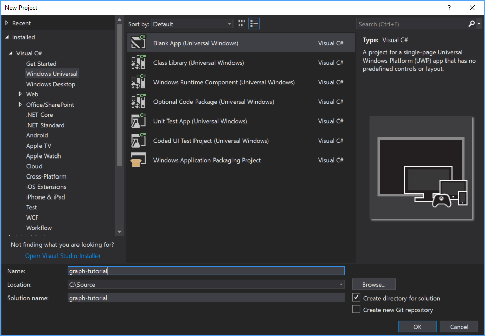
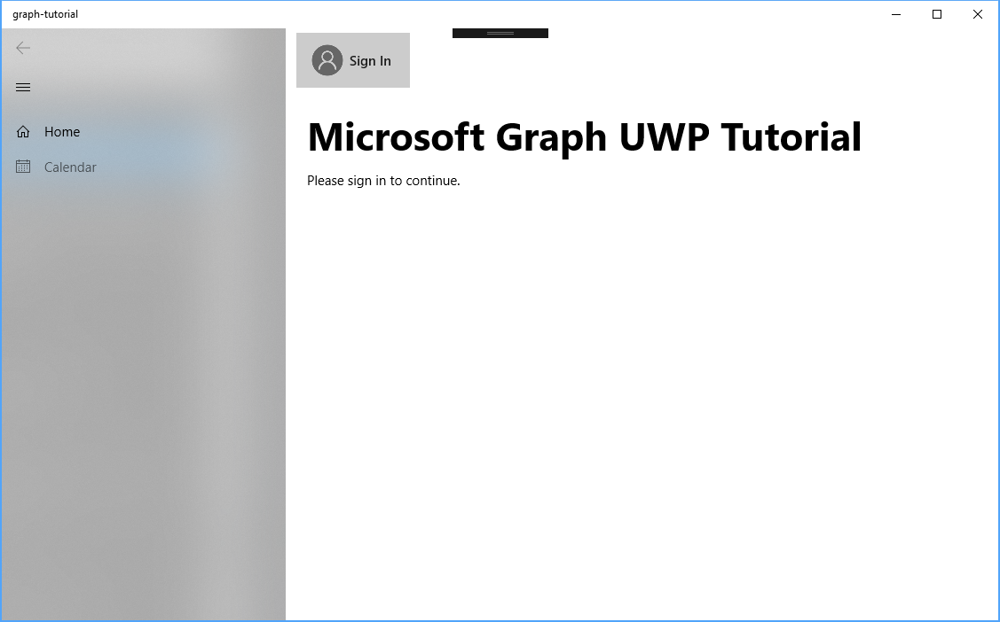

<!-- markdownlint-disable MD002 MD041 -->

Open Visual Studio, and select **File > New > Project**. In the **New Project** dialog, do the following:

1. Select **Templates > Visual C# > Windows Universal**.
1. Select **Blank App (Universal Windows)**.
1. Enter **graph-tutorial** for the Name of the project.



> [!IMPORTANT]
> Ensure that you enter the exact same name for the Visual Studio Project that is specified in these lab instructions. The Visual Studio Project name becomes part of the namespace in the code. The code inside these instructions depends on the namespace matching the Visual Studio Project name specified in these instructions. If you use a different project name the code will not compile unless you adjust all the namespaces to match the Visual Studio Project name you enter when you create the project.

Select **OK**. In the **New Universal Windows Platform Project** dialog, ensure that the **Minimum version** is set to `Windows 10 Fall Creators Update (10.0; Build 16299)` or later and select **OK**.

Before moving on, install some additional NuGet packages that you will use later.

- [Microsoft.Toolkit.Uwp.Ui.Controls](https://www.nuget.org/packages/Microsoft.Toolkit.Uwp.Ui.Controls/) to add some UI controls for in-app notifications and loading indicators.
- [Microsoft.Toolkit.Uwp.Ui.Controls.DataGrid](https://www.nuget.org/packages/Microsoft.Toolkit.Uwp.Ui.Controls.DataGrid/) to display the information returned by Microsoft Graph.
- [Microsoft.Toolkit.Uwp.Ui.Controls.Graph](https://www.nuget.org/packages/Microsoft.Toolkit.Uwp.Ui.Controls.Graph/) to handle login and access token retrieval.
- [Microsoft.Graph](https://www.nuget.org/packages/Microsoft.Graph/) for making calls to the Microsoft Graph.

Select **Tools > NuGet Package Manager > Package Manager Console**. In the Package Manager Console, enter the following commands.

```Powershell
Install-Package Microsoft.Toolkit.Uwp.Ui.Controls
Install-Package Microsoft.Toolkit.Uwp.Ui.Controls.DataGrid
Install-Package Microsoft.Toolkit.Uwp.Ui.Controls.Graph
Install-Package Microsoft.Graph
```

## Design the app

Start by adding an application-level variable to track authentication state. In Solution Explorer, expand **App.xaml** and open **App.xaml.cs**. Add the following property to the `App` class.

```cs
public bool IsAuthenticated { get; set; }
```

Next, define the layout for the main page. Open `MainPage.xaml` and replace its entire contents with the following.

```xml
<Page
    x:Class="graph_tutorial.MainPage"
    xmlns="http://schemas.microsoft.com/winfx/2006/xaml/presentation"
    xmlns:x="http://schemas.microsoft.com/winfx/2006/xaml"
    xmlns:local="using:graph_tutorial"
    xmlns:d="http://schemas.microsoft.com/expression/blend/2008"
    xmlns:mc="http://schemas.openxmlformats.org/markup-compatibility/2006"
    xmlns:controls="using:Microsoft.Toolkit.Uwp.UI.Controls"
    xmlns:graphControls="using:Microsoft.Toolkit.Uwp.UI.Controls.Graph"
    mc:Ignorable="d"
    Background="{ThemeResource ApplicationPageBackgroundThemeBrush}">

    <Grid>
        <NavigationView x:Name="NavView"
            IsSettingsVisible="False"
            ItemInvoked="NavView_ItemInvoked">

            <NavigationView.Header>
                <graphControls:AadLogin x:Name="Login"
                    HorizontalAlignment="Left"
                    View="SmallProfilePhotoLeft"
                    AllowSignInAsDifferentUser="False"
                    />
            </NavigationView.Header>

            <NavigationView.MenuItems>
                <NavigationViewItem Content="Home" x:Name="Home" Tag="home">
                    <NavigationViewItem.Icon>
                        <FontIcon Glyph="&#xE10F;"/>
                    </NavigationViewItem.Icon>
                </NavigationViewItem>
                <NavigationViewItem Content="Calendar" x:Name="Calendar" Tag="calendar">
                    <NavigationViewItem.Icon>
                        <FontIcon Glyph="&#xE163;"/>
                    </NavigationViewItem.Icon>
                </NavigationViewItem>
            </NavigationView.MenuItems>

            <StackPanel>
                <controls:InAppNotification x:Name="Notification" ShowDismissButton="true" />
                <Frame x:Name="RootFrame" Margin="24, 0" />
            </StackPanel>
        </NavigationView>
    </Grid>
</Page>
```

This defines a basic [NavigationView](https://docs.microsoft.com/uwp/api/windows.ui.xaml.controls.navigationview) with **Home** and **Calendar** navigation links to act as the main view of the app. It also adds an [AadLogin](https://docs.microsoft.com/dotnet/api/microsoft.toolkit.uwp.ui.controls.graph.aadlogin?view=win-comm-toolkit-dotnet-stable) control in the header of the view. That control will allow the user to sign in and out. The control isn't fully enabled yet, you will configure it in a later exercise.

Now add another XAML page for the Home view. Right-click the **graph-tutorial** project in Solution Explorer and choose **Add > New Item...**. Choose **Blank Page**, enter `HomePage.xaml` in the **Name** field, and choose **Add**. Add the following code inside the `<Grid>` element in the file.

```xml
<StackPanel>
    <TextBlock FontSize="44" FontWeight="Bold" Margin="0, 12">Microsoft Graph UWP Tutorial</TextBlock>
    <TextBlock x:Name="HomePageMessage">Please sign in to continue.</TextBlock>
</StackPanel>
```

Now expand **MainPage.xaml** in Solution Explorer and open `MainPage.xaml.cs`. Add the following code to the `MainPage()` constructor **after** the `this.InitializeComponent();` line.

```cs
// Initialize auth state to false
SetAuthState(false);

// Navigate to HomePage.xaml
RootFrame.Navigate(typeof(HomePage));
```

When the app first starts, it will initialize the authentication state to `false` and navigate to the home page.

Add the following function to the `MainPage` class to manage authentication state.

```cs
private void SetAuthState(bool isAuthenticated)
{
    (App.Current as App).IsAuthenticated = isAuthenticated;

    // Toggle controls that require auth
    Calendar.IsEnabled = isAuthenticated;
}
```

Add the following event handler to load the requested page when the user selects an item from the navigation view.

```cs
private void NavView_ItemInvoked(NavigationView sender, NavigationViewItemInvokedEventArgs args)
{
    var invokedItem = args.InvokedItem as string;

    switch (invokedItem.ToLower())
    {
        case "calendar":
            throw new NotImplementedException();
            break;
        case "home":
        default:
            RootFrame.Navigate(typeof(HomePage));
            break;
    }
}
```

Save all of your changes, then press **F5** or select **Debug > Start Debugging** in Visual Studio.

